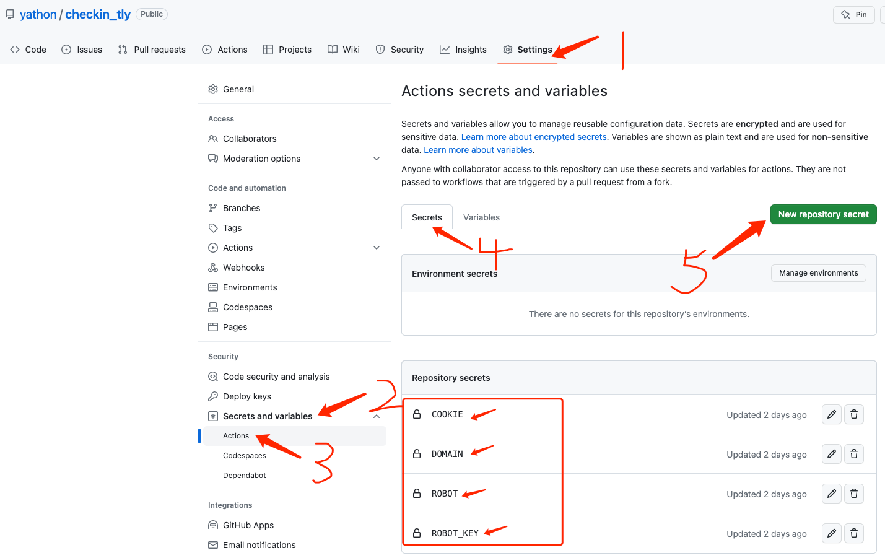

# checkin_tly

Automatically check in on a daily schedule.

## 参数说明

- DOMAIN: tly 的域名地址，不包含"https://"。
- COOKIE: 登录后的Cookie，不会找的上网搜索教程。
- ROBOT: 消息通知机器人token，支持钉钉和企业微信，自动识别。
- ROBOT_KEY: 钉钉机器人需要关键字才能发送成功，企业微信可以为空，但是必须设置该字段。

设置仓库的环境变量如下图：

